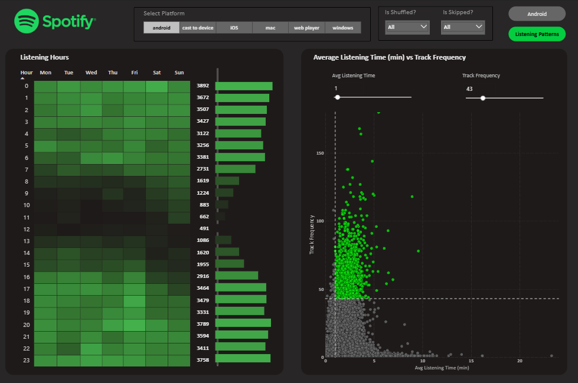
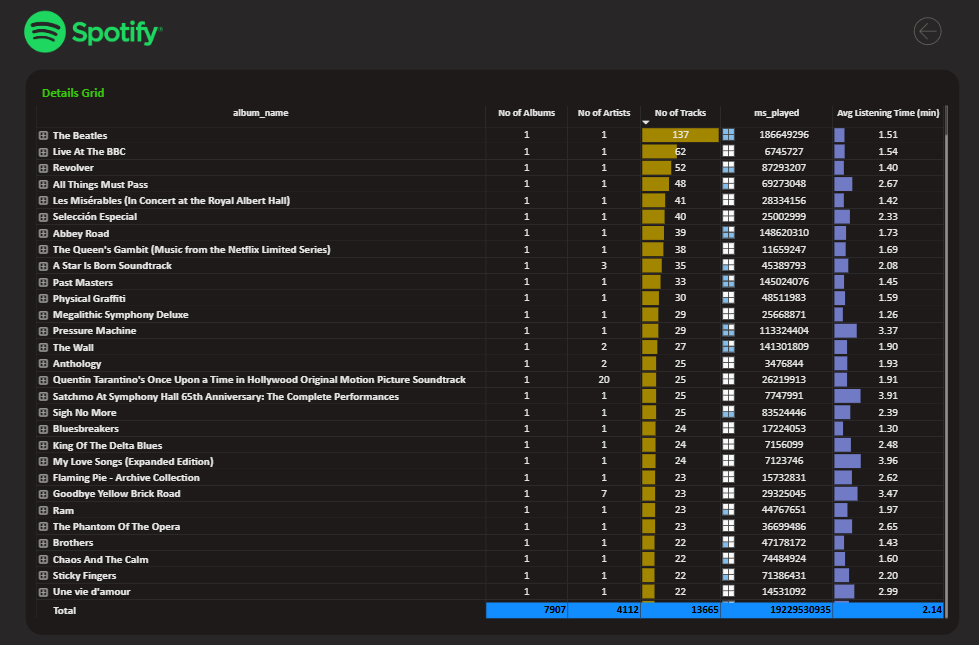

# Spotify Listening Data Analysis (Power BI)

## Overview
This project is a **Data Analyst portfolio project** focused on analyzing Spotify listening data using **Power BI**.
The objective is to explore listening behavior, identify trends, and transform raw data into meaningful insights through clear and interactive dashboards.

## Business Questions Addressed
- How does listening activity change over time?
- Which albums, artists, and tracks are played the most?
- How does listening behavior differ by platform?
- At what hours and days is listening activity the highest?
- Is there a relationship between listening time and track frequency?
- How do listening patterns change year-over-year?

## Dashboards & Key Insights
The Power BI report includes:
- Albums, artists, and tracks played over time
- Year-over-year comparison (Latest Year vs Previous Year)
- Top albums, artists, and tracks by total play count
- Listening activity heatmap by hour and day of the week
- Average listening time vs track frequency analysis
- Platform usage filters (Android, iOS, desktop, web player)
- Shuffle and skip behavior analysis

## Tools & Technologies
- **Power BI**
- **DAX**
- Data modeling
- Data cleaning & transformation
- Interactive dashboards

## Dashboard Preview

### Overview

### Listening Patterns

### Details_Grid

